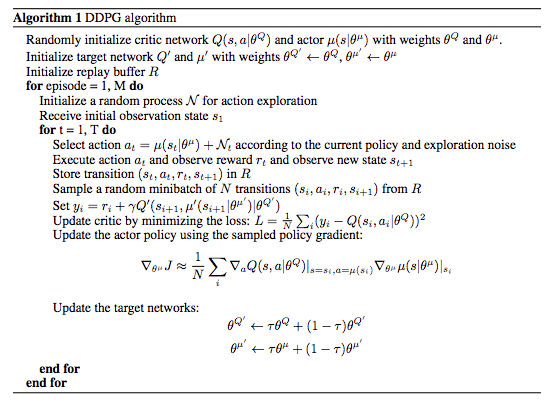
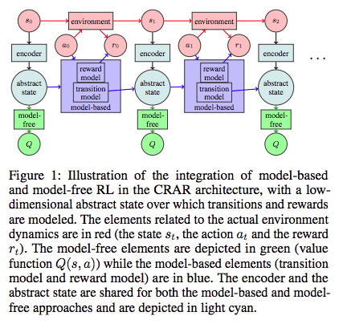
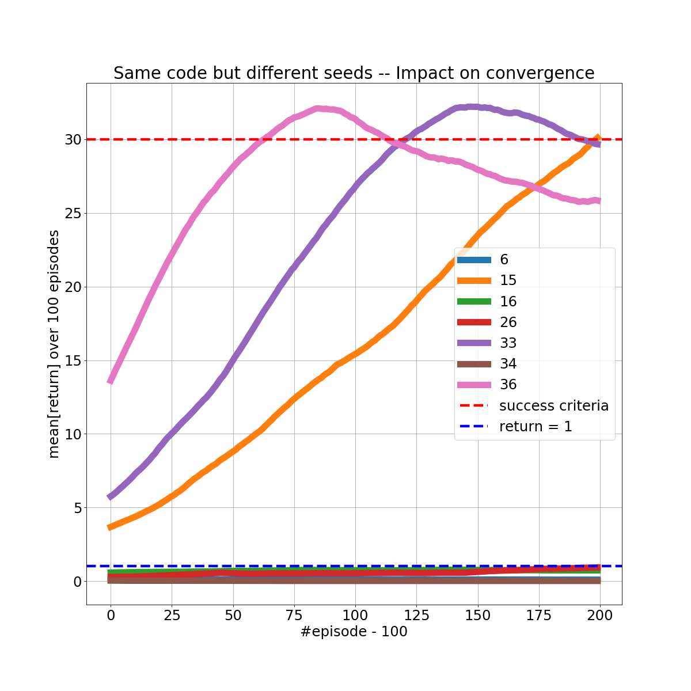

# DRLND-Project2 Report
DRLND Project 2 - Continuous Control (Reacher environment)

## Learning Algorithm

The learning algorithm implemented for this project is a **Deep Deterministic Policy Gradients (DDPG)** patterned on the DDPG example in the [lesson from Udacity](https://github.com/udacity/deep-reinforcement-learning/tree/master/ddpg-bipedal). DDPG, as described by Lillicrap et al in [Continuous Control With Deep Reinforcement Learning](https://arxiv.org/pdf/1509.02971.pdf), is "an algorithm that robustly solves challenging problems across a variety of domains with continuous action spaces" by using an actor-critic framework with a replay buffer.



Specifically, the **diff** below shows the addition of the *num_agents* parameter to the renamed **Agents** class, since the environment contained 20 instances of the virtual reacher "arm" that contributed to learning simultaneously via the two Actor and Critic agents (hence, *states* and *actions*).

```diff
$ diff ddpg_agent.py deep-reinforcement-learning/ddpg-bipedal/ddpg_agent.py
...
22c22
< class Agents():
---
> class Agent():
25c25
<     def __init__(self, state_size, action_size, num_agents, random_seed):
---
>     def __init__(self, state_size, action_size, random_seed):
32d31
<             num_agents (int): number of agents
37d35
<         self.num_agents = num_agents
51c49
<         self.noise = OUNoise((num_agents, action_size), random_seed)
---
>         self.noise = OUNoise(action_size, random_seed)
59,60c57
<         for i in range(self.num_agents):
<             self.memory.add(state[i,:], action[i,:], reward[i], next_state[i,:], done[i])
---
>         self.memory.add(state, action, reward, next_state, done)
67c64
<     def act(self, states, add_noise=True):
---
>     def act(self, state, add_noise=True):
69,70c66
<         states = torch.from_numpy(states).float().to(device)
<         actions = np.zeros((self.num_agents, self.action_size))
---
>         state = torch.from_numpy(state).float().to(device)
73,75c69
<             for agent_num, state in enumerate(states):
<                 action = self.actor_local(state).cpu().data.numpy()
<                 actions[agent_num, :] = action
---
>             action = self.actor_local(state).cpu().data.numpy()
78,79c72,73
<             actions += self.noise.sample()
<         return np.clip(actions, -1, 1)
---
>             action += self.noise.sample()
>         return np.clip(action, -1, 1)
...

```

#### Hyperparameters

```python
BATCH_SIZE = 128        # minibatch size
BUFFER_SIZE = int(1e5)  # replay buffer size
GAMMA = 0.99            # discount factor
LR_ACTOR = 1e-4         # learning rate of the actor 
LR_CRITIC = 1e-3        # learning rate of the critic
TAU = 1e-3              # for soft update of target parameters
WEIGHT_DECAY = 0        # L2 weight decay
```

These hyperparameters are altered slightly from the Udacity example. The BATCH_SIZE and BUFFER_SIZE are parameters for the **ReplayBuffer** class, a "memory" of 100 000 actions which is randomly sampled at each step to obtain _experiences_ passed into the **learn** method with a discount of GAMMA. WEIGHT_DECAY, LR_ACTOR and LR_CRITIC are parameters to the **Adam** optimizer. Finally, TAU is a parameter for a _soft update_ of the target and local models.

#### Model Architecture

The **Actor** is a mapping of state to action values via 3 fully connected **Linear** layers with **relu** activation. The final output layer yields 4 values with **tanh** activation. 

The **Critic** is a value function, measuring the quality of the actions via 3 fully connected **Linear** layers with **relu** activation with the third layer yielding the single output value. 

## Plot of Rewards


## Ideas for Future Work

Given more compute resources, this project would benefit from a exploration of the sensitivity of the results to changing the hyperparameters and the architecture (particularly the *depth*) of the Actor and Critic models.

These are exciting times for Reinforcement Learning (RL). New and better algorithms are being proposed to address issues of **stability** (seen in the [report by Simon Chauvin](https://drlnd.slack.com/archives/CBMG84E2Y/p1538723040000100) on different seeds, image below) and **explainability**.  The paper [Combined Reinforcement Learning via Abstract Representations](https://arxiv.org/pdf/1809.04506.pdf) suggested combining model-free and model-based approaches via a shared low-dimensional encoding of the environment as shown in Figure 1 below:




This "Combined Reinforcement via Abstract Representations (CRAR)" architecture has the intuitive appeal of learning "an abstract representation" which we can think of as the *gist* of the task. In the case of the **Reacher** arm, we'd like to have a system which learned -- and could possibly be interpreted to reveal -- the *idea* of moving-around-in-a-circle to stay in touch with the goal sphere. 

The next step for improving agent performance in this project would be to re-implement it using CRAR.

Then, there is lots more to study at [http://bit.ly/drlndlinks](http://bit.ly/drlndlinks)!


---

Study by Simon Chauvin, posted to DRLND Slack team, #project-2_continuous channel:

